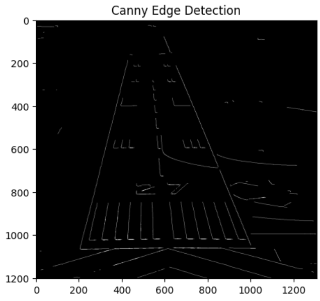
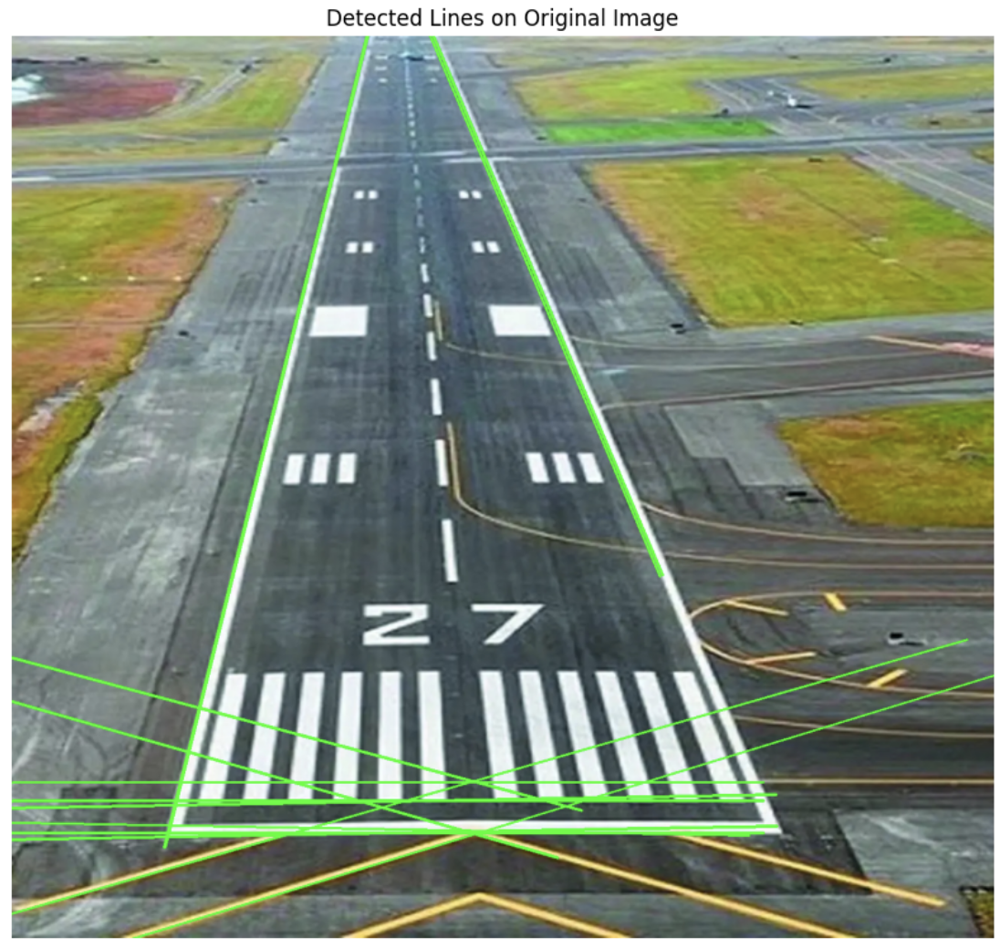
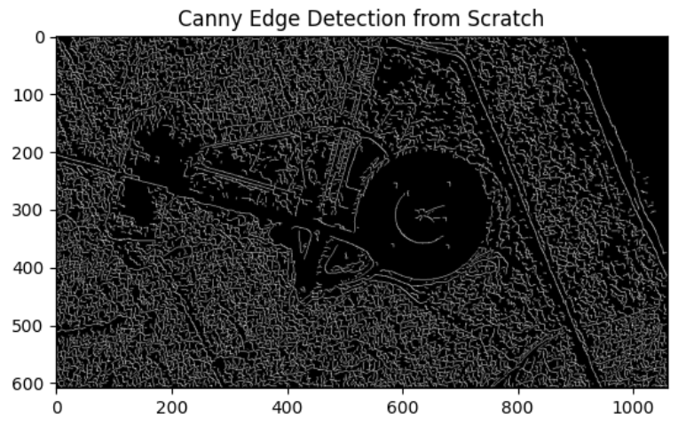
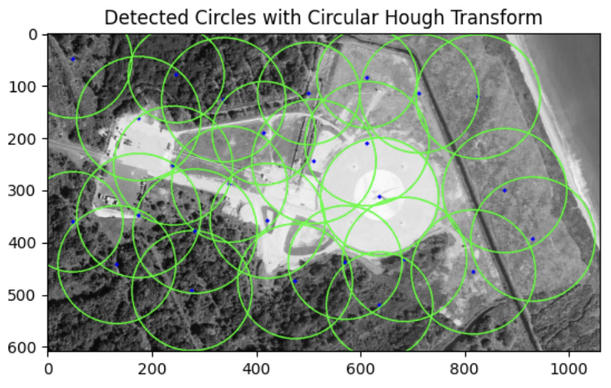

# Edge & Line Detection with Canny and Hough Transform

This project implements **Canny Edge Detection**, the **Hough Line Transform**, and the **Hough Circle Transform** using NumPy and OpenCV. It’s applied to a cluttered aerial runway image to detect both edges, lines, and circular structures.

---

The notebook performs:

1. **Custom Canny Edge Detection**:
   - Gaussian blur to reduce noise
   - Sobel filters to compute image gradients
   - Non-maximum suppression to thin edges
   - Double thresholding and hysteresis to finalize edge maps

2. **Hough Line Transform**:
   - Accumulator-based voting to detect straight lines
   - Drawing of lines on the original image for visualization

3. **Circular Hough Transform**:
   - Uses OpenCV's `HoughCircles` to detect circular objects
   - Overlays detected circles on the original image

---

### Step 1: Apply Gaussian Blur

We start by reading a cluttered grayscale runway image and reduce noise by convolving the image with a manually constructed Gaussian kernel.

```python
blurred_image = gaussian_blur(image, kernel_size=5, sigma=1.4)
```
---

### Step 2: Compute Image Gradients (Sobel Filters)

We use Sobel filters to compute gradients in X and Y directions and get:
- **Gradient Magnitude**
- **Gradient Direction**

```python
G, theta = sobel_filters(blurred_image)
```

---

### Step 3: Non-Maximum Suppression

Suppress non-maximum pixels in gradient direction to thin out the edges.

```python
thin_edges = non_max_suppression(G, theta)
```

---

### Step 4: Double Thresholding

Classify pixels as **strong**, **weak**, or **non-edge** based on intensity.

```python
thresh_img = threshold(thin_edges, low=50, high=150)
```

---

### Step 5: Edge Tracking by Hysteresis

Connect weak pixels to strong ones if they’re adjacent; this is the final edge map.

```python
edges = hysteresis(thresh_img)
```

<p float="left">
  
</p>

---

### Step 6: Hough Line Transform

We apply a from-scratch Hough Transform to vote for straight lines in the image space.

```python
lines = hough_line_transform(edges, threshold=150)
```

---

### Step 7: Visualize Detected Lines

Lines are drawn on the **original color image** using the detected `(rho, theta)` pairs.

```python
drawn_img = draw_lines(original_image.copy(), lines)
```

<p float="left">
  
</p>

---

### Step 8: Circular Hough Transform

We also use OpenCV's `HoughCircles` method to detect circles:

```python
circles = cv2.HoughCircles(
    image,
    cv2.HOUGH_GRADIENT,
    dp=1.2,
    minDist=20,
    param1=50,
    param2=30,
    minRadius=10,
    maxRadius=80
)
```

Circles are drawn on top of the grayscale image:


<p float="left">
  
  
</p>

---

